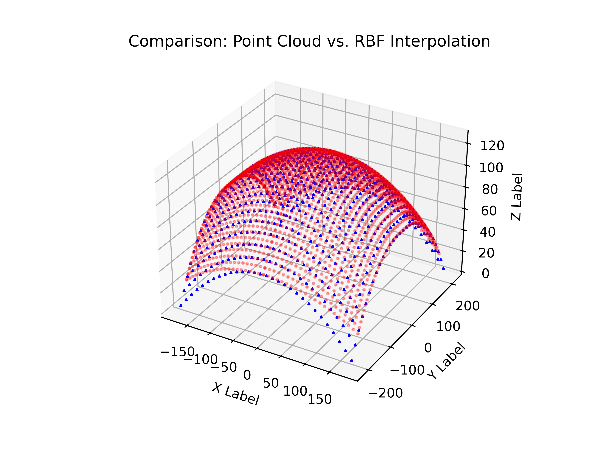
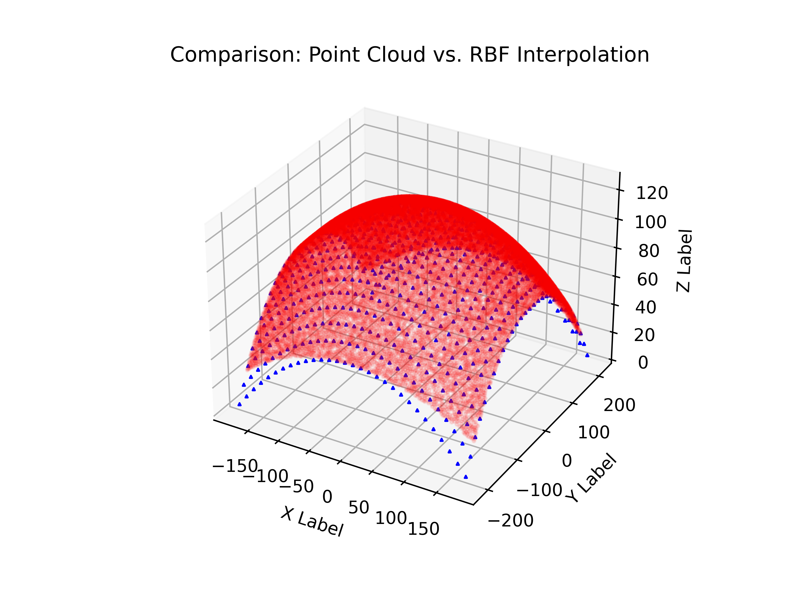
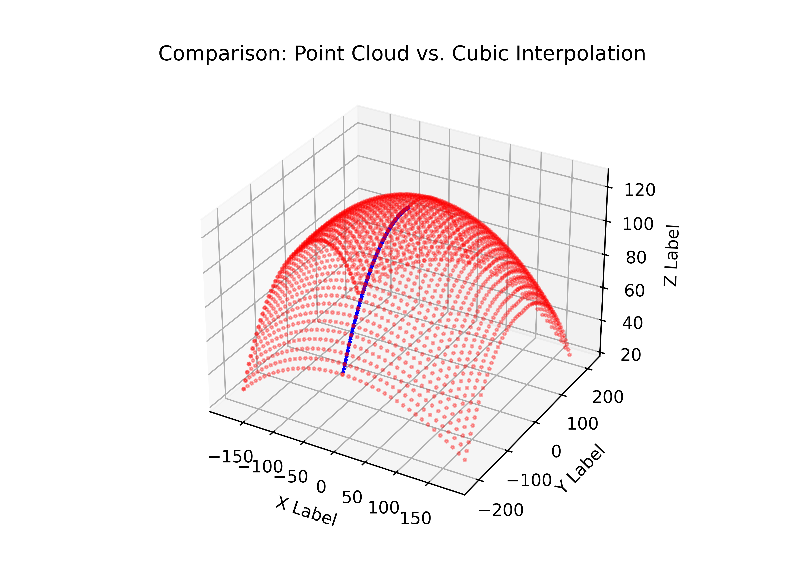
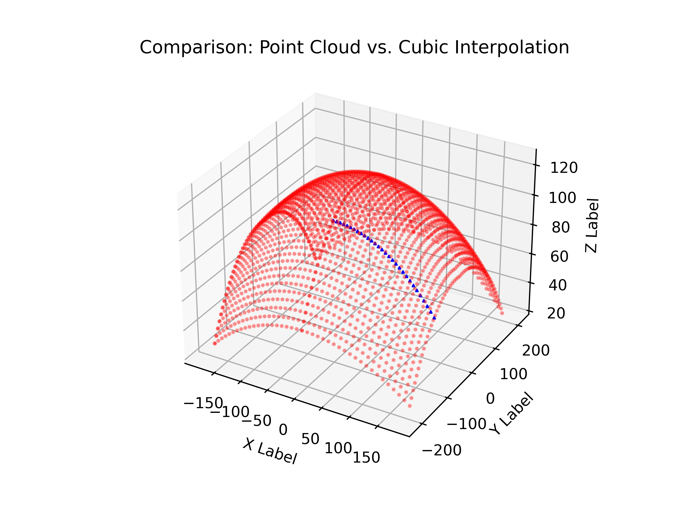
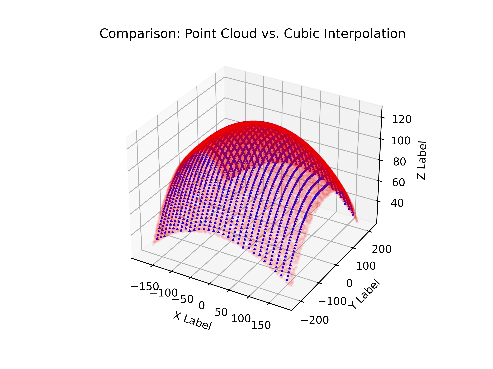

# DSIF-of-FRP

## RBFInterpolator

Generates the following plot when using RBFInterpolator function of SciPy

When the points are sampled evenly and more points are generated over the surface.

## Griddata interpolation

Thhe following output is generated when the pointclouds are used with griddata interpolation having a cubic method.

If only one line along x and y direction is preferred.

 

When more points are sampled over the whole surface.

